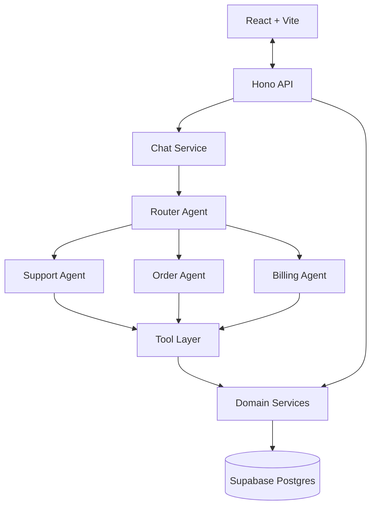

# Support Desk AI

Multi-agent customer support system with intelligent routing. A router agent classifies each incoming message, then delegates to a specialist sub-agent — order, billing, or support — that only sees the tools for its own domain.

## Why a router, not one big prompt

A single LLM given every tool for every domain degrades badly: tool selection gets worse as the tool count grows, the system prompt becomes a bloated compromise, billing logic leaks into order conversations, and nothing is independently testable. Routing first keeps each agent's prompt focused, its tool set small, and its behavior testable in isolation — the router's classification is a separate, non-streaming call with no tools, so routing can be unit-tested without mocking a whole conversation.



REST routes and agent tools share one data-access path — the domain services — so there is never a second, divergent way to read the same data.

## Tech stack

| Category | Choice |
| -------- | ------ |
| Monorepo | Turborepo + pnpm workspaces |
| Backend | Hono.dev (Node runtime) |
| Frontend | React 19 + Vite |
| Language | TypeScript (strict) |
| Database | Supabase (managed PostgreSQL) |
| ORM | Prisma |
| AI | Vercel AI SDK (`ai` v7) + `@ai-sdk/anthropic` |
| Type safety | Hono RPC (`hc<AppType>`) |
| Validation | Zod |
| Styling | Tailwind CSS v4 |
| Testing | Vitest |

## Running the project

### Prerequisites

- Node.js 20+
- pnpm (via `corepack enable pnpm` if you don't have it — this repo pins `pnpm@9.15.0` in `package.json`)
- A [Supabase](https://supabase.com) project (free tier is fine) — used purely as a Postgres host, nothing else
- An [Anthropic API key](https://console.anthropic.com) with available credit

### 1. Install dependencies

```bash
pnpm install
```

This also runs `prisma generate` automatically (wired as a `postinstall` script in `backend`).

### 2. Configure environment variables

Copy the example file:

```bash
cp backend/.env.example backend/.env
```

Then fill in `backend/.env`:

```bash
DATABASE_URL="postgresql://...@...:6543/postgres?pgbouncer=true"  # Supabase → Settings → Database → Connection string → Transaction pooler
DIRECT_URL="postgresql://...@...:5432/postgres"                    # same page → Session/direct connection (used only for migrations)
ANTHROPIC_API_KEY=""                                                # console.anthropic.com → API keys
ROUTER_MODEL="claude-haiku-4-5-20251001"   # small/fast model for classification
AGENT_MODEL="claude-sonnet-5"              # stronger model for sub-agents
PORT=3001
```

Both `DATABASE_URL` and `DIRECT_URL` come from the same Supabase project — one is the pooled connection (runtime queries), the other the direct connection (migrations only). If your database password contains special characters (`@`, `:`, `?`, `#`, `/`), percent-encode them or the connection string will fail to parse.

The frontend needs no `.env` for local dev — `frontend/.env.example` documents `VITE_API_URL`, which defaults to `http://localhost:3001` in code. It only matters if the backend runs somewhere other than that (see Deployment below).

### 3. Set up the database

```bash
pnpm db:migrate   # applies the Prisma schema (prisma migrate dev)
pnpm db:seed      # 3 users, 8 orders across every status, shipments, invoices, refunds, sample conversations
```

### 4. Start the app

```bash
pnpm dev
```

This runs both workspaces in parallel via Turborepo: the Hono backend on **http://localhost:3001** and the Vite frontend on **http://localhost:5173**.

Open **http://localhost:5173** in a browser. There's no authentication — pick one of the three seeded users from the switcher in the top-right header and start chatting (try asking about an order number like `ORD-1004`, or an invoice like `INV-2002`).

To confirm the backend alone is up: `curl http://localhost:3001/health`.

### Other commands

```bash
pnpm build        # typecheck + build both workspaces
pnpm typecheck     # tsc --noEmit, both workspaces
pnpm test          # backend vitest suite (hits the live seeded DB and the real Anthropic API)
```

## Deployment

Backend on Railway, frontend on Vercel, database stays on Supabase. Deploy the backend first — the frontend needs its URL.

### 1. Backend → Railway

1. Create a new Railway project from this GitHub repo (New Project → Deploy from GitHub repo).
2. Railway auto-detects `railway.json` at the repo root, which sets the build to `pnpm install && pnpm --filter backend build` and the start command to run `prisma migrate deploy` before `pnpm --filter backend start` — no dashboard config needed for build/start.
3. Add environment variables (Railway project → Variables): `DATABASE_URL`, `DIRECT_URL`, `ANTHROPIC_API_KEY`, `ROUTER_MODEL`, `AGENT_MODEL` — same values as `backend/.env`. Don't set `PORT`; Railway injects its own and the app already reads `process.env.PORT`.
4. Deploy, then note the public URL Railway assigns (Settings → Networking → Generate Domain if one isn't already there), e.g. `https://your-app.up.railway.app`.
5. Leave `CORS_ORIGIN` unset for now — it defaults to `http://localhost:5173`, which you'll fix in step 3 below once the frontend has a URL.

### 2. Frontend → Vercel

1. Import the same GitHub repo as a new Vercel project.
2. Vercel auto-detects `vercel.json` at the repo root (`pnpm --filter frontend build`, output `frontend/dist`, install runs at the repo root so the frontend's workspace link to `backend`'s types resolves correctly) — leave Root Directory as the repo root, don't point it at `frontend/`.
3. Add one environment variable: `VITE_API_URL` = the Railway URL from step 1.4 (e.g. `https://your-app.up.railway.app`).
4. Deploy, then note the URL Vercel assigns (e.g. `https://your-app.vercel.app`).

### 3. Close the loop: CORS

Back in Railway, set `CORS_ORIGIN` to the Vercel URL from step 2.4, then redeploy the backend (Railway redeploys automatically on a variable change). Without this the browser will block every request with a CORS error even though the backend is reachable.

### Verifying

- `curl https://your-app.up.railway.app/health` should return `{"status":"ok",...}`.
- Open the Vercel URL — the app should load, the user switcher should populate, and sending a message should stream a reply. Check the browser console for CORS errors first if anything hangs.

## Repository structure

```
backend/
  src/
    routes/         # thin Hono route wiring, chained into one AppType
    controllers/     # parse input, call one service, shape the response
    services/        # business logic, typed errors, Decimal/Date → plain values at the boundary
    agents/
      router.agent.ts        # generateText + Output.object, no tools, no streaming
      order|billing|support|fallback.agent.ts   # streamText + domain tools
      tools/          # Zod-typed wrappers over services, one file per domain
      lib/            # createServiceTool (graceful tool-error handling), message mapping
      prompts/        # one system prompt per agent, own file
    middleware/       # error.middleware (typed errors → HTTP status), rate-limit.middleware
    db/               # PrismaClient singleton
  prisma/
    schema.prisma
    seed.ts
frontend/
  src/
    components/chat/   # Sidebar, MessageThread, MessageBubble, StreamingMessageBubble, ...
    hooks/              # useConversations, useConversation, useStreamMessage, ... (wrap the RPC client)
    lib/client.ts       # hc<AppType>
context/
  features/             # one doc per Build Order phase — goals, what shipped, decisions made
vercel.json              # frontend build config (Vercel)
railway.json             # backend build/start config (Railway)
```

## API

```
/api
├── /chat
│   ├── POST   /messages               # send a message; streams NDJSON (routing → text-delta* → done)
│   ├── GET    /conversations          # list a user's conversations
│   ├── GET    /conversations/:id      # get one conversation with its messages
│   └── DELETE /conversations/:id
├── /agents
│   ├── GET /agents                    # registry: label, color, icon, tools per agent
│   └── GET /agents/:type/capabilities
├── /users                             # seeded users, for the client-side switcher (no auth)
└── /health
```

`POST /chat/messages` streams newline-delimited JSON rather than returning one JSON blob: a `routing` event fires immediately after classification (before the sub-agent has produced any text), so the UI can show the agent badge and a "thinking" state right away; `text-delta` events follow as the reply streams; a final `done` event carries the message once it's persisted. The assistant message is written to the database exactly once, after the stream completes.

## Error handling

Domain services throw typed errors (`NotFoundError`, `ValidationError`, `ExternalServiceError`, `RateLimitError`) that carry their own HTTP status. One `app.onError` middleware maps them to a response; controllers never contain `try/catch`. The one exception is tool execution: a tool that throws is caught inside the agent layer (`createServiceTool`) and returned to the model as a result describing the failure, so the agent can say "I couldn't find that order number" in prose instead of the stream dying mid-sentence.

## Testing

The backend test suite runs against the real seeded Supabase database and the real Anthropic API — no mocks. Router classification is tested directly (`classifyIntent`) rather than through a full conversation, which is the point of keeping routing a separate, structured, non-streaming call. Domain services are tested against known seeded rows (order numbers, invoice numbers); the middleware tests build a throwaway Hono app inline.

## Notes on scope

Full history and the reasoning behind each decision lives in `context/features/` (one file per Build Order phase). A few worth calling out:

- **Streaming**: chat responses buffer must-ship first (Phase 4), then upgraded to real token streaming (Phase 5) once the baseline was solid — matches project-spec.md's own priority list, which puts "streaming responses" below the must-ship bar.
- **Deployment**: out of scope for the graded build per project-spec.md (despite appearing in project-overview.md's bonus table), added afterward — see the Deployment section above.
- **Rate limiting**: a simple in-memory fixed-window limiter on `POST /chat/messages` (20 req/min), the one endpoint that costs real LLM calls. Single-process only by design — a multi-instance deployment would need a shared store.
