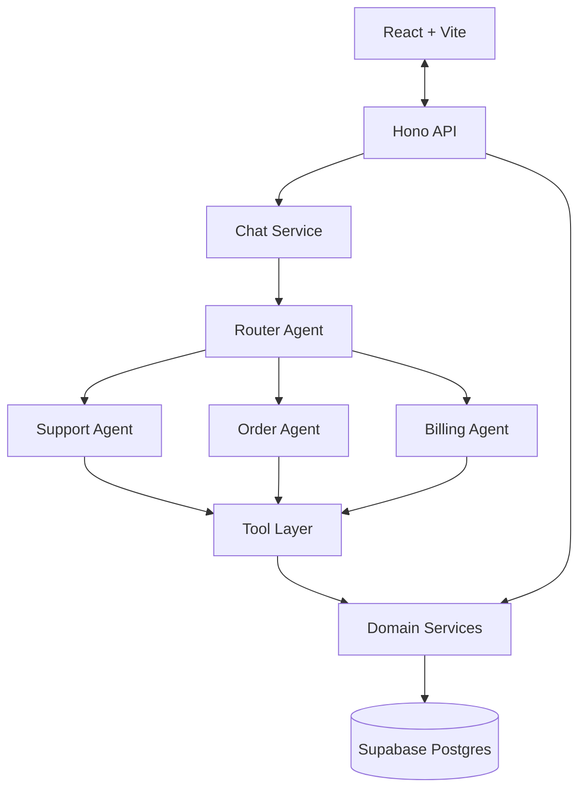
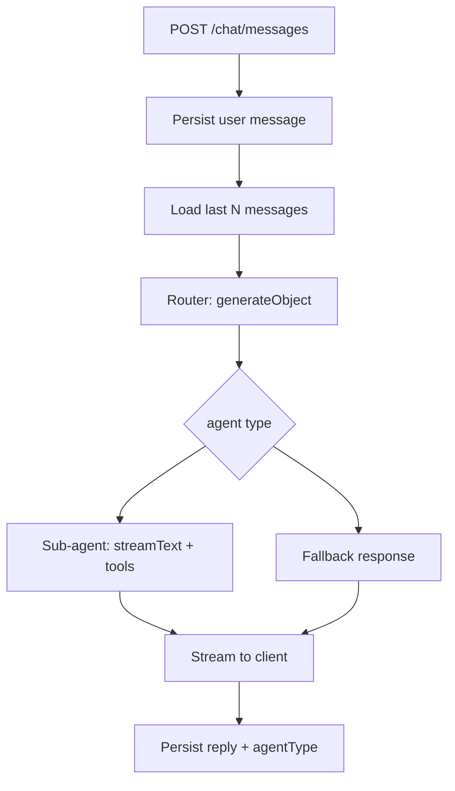

## Support Desk AI — Project Specifications
 
🤖 Multi-agent customer support system with intelligent routing
 
---
 
## 📌 Problem (Core Idea)
 
Customer support queries arrive undifferentiated. A single LLM given every tool for every domain performs badly:
 
- Tool selection degrades as the tool count grows
- Prompts become bloated compromises that serve no domain well
- Billing logic leaks into order conversations
- Nothing is independently testable — one prompt, one blast radius
➡️ **A router agent classifies intent first, then delegates to a specialist sub-agent that only sees the tools for its own domain.**
 
Each sub-agent has a focused system prompt, a small tool set, and access to shared conversation history so context survives across turns and across agent handoffs.
 
---
 
## 🧑‍💻 Users
 
| Persona | Needs |
| ------- | ----- |
| Customer with an order question | Status, tracking, cancellation, modification |
| Customer with a billing question | Invoices, refund status, subscription queries |
| Customer with a general question | FAQs, troubleshooting, prior conversation recall |
| Reviewer (assessment grader) | Legible architecture, testable routing, clean data flow |
 
---
 
## ✨ Core Features
 
### A) Router Agent (parent)
 
- Analyzes each incoming customer query
- Classifies intent into one of: `support` | `order` | `billing` | `fallback`
- Delegates to the matching sub-agent
- Handles fallback for unclassified or out-of-scope queries
- Emits its reasoning so the UI can display why a route was chosen
### B) Sub-Agents
 
| Agent | Handles | Tools |
| ----- | ------- | ----- |
| Support | General inquiries, FAQs, troubleshooting | `searchConversationHistory` |
| Order | Order status, tracking, modifications, cancellations | `fetchOrderDetails`, `checkDeliveryStatus` |
| Billing | Payment issues, refunds, invoices, subscriptions | `getInvoiceDetails`, `checkRefundStatus` |
 
### C) Tools
 
- Every tool is a name, a Zod input schema, and a single call into a domain service
- Tools contain **no business logic** — they are typed wrappers
- Tools read real rows from Postgres; the database is seeded, not stubbed
- The same domain services back both the tools and the REST routes
### D) Conversation Context
 
- The chat service loads the last N messages before invoking the router
- Agents receive context as an argument and stay stateless
- Every user message and agent reply is persisted with its `agentType`
### E) Streaming & Realtime
 
- Agent responses stream token-by-token to the client
- "Agent is typing" indicator driven by the stream lifecycle
- Reasoning/status text surfaced during tool calls ("Checking your order…")
### F) Error Handling
 
- Domain services throw typed errors (`NotFoundError`, `ValidationError`)
- One error middleware maps error class to HTTP status
- Controllers never contain `try/catch`
---
 
## 🗄️ Data Model (Rough Prisma Draft)
 
> This schema is a starting point and **will evolve**
 
```prisma
enum MessageRole {
  user
  assistant
}
 
enum AgentType {
  router
  support
  order
  billing
  fallback
}
 
enum OrderStatus {
  pending
  processing
  shipped
  delivered
  cancelled
}
 
enum ShipmentStatus {
  label_created
  in_transit
  out_for_delivery
  delivered
  exception
}
 
enum InvoiceStatus {
  draft
  open
  paid
  void
}
 
enum RefundStatus {
  requested
  approved
  processing
  completed
  rejected
}
 
model User {
  id            String         @id @default(uuid())
  email         String         @unique
  name          String
  conversations Conversation[]
  orders        Order[]
  invoices      Invoice[]
  createdAt     DateTime       @default(now())
}
 
model Conversation {
  id        String    @id @default(uuid())
  userId    String
  user      User      @relation(fields: [userId], references: [id], onDelete: Cascade)
  title     String?
  messages  Message[]
  createdAt DateTime  @default(now())
  updatedAt DateTime  @updatedAt
 
  @@index([userId, updatedAt])
}
 
model Message {
  id             String       @id @default(uuid())
  conversationId String
  conversation   Conversation @relation(fields: [conversationId], references: [id], onDelete: Cascade)
  role           MessageRole
  content        String
  agentType      AgentType?
  reasoning      String?
  toolCalls      Json?
  createdAt      DateTime     @default(now())
 
  @@index([conversationId, createdAt])
}
 
model Order {
  id          String      @id @default(uuid())
  userId      String
  user        User        @relation(fields: [userId], references: [id])
  orderNumber String      @unique
  status      OrderStatus
  total       Decimal     @db.Decimal(10, 2)
  items       OrderItem[]
  shipments   Shipment[]
  invoices    Invoice[]
  placedAt    DateTime    @default(now())
}
 
model OrderItem {
  id          String  @id @default(uuid())
  orderId     String
  order       Order   @relation(fields: [orderId], references: [id], onDelete: Cascade)
  productName String
  quantity    Int
  unitPrice   Decimal @db.Decimal(10, 2)
}
 
model Shipment {
  id                String         @id @default(uuid())
  orderId           String
  order             Order          @relation(fields: [orderId], references: [id], onDelete: Cascade)
  carrier           String
  trackingNumber    String
  status            ShipmentStatus
  estimatedDelivery DateTime?
}
 
model Invoice {
  id            String        @id @default(uuid())
  userId        String
  user          User          @relation(fields: [userId], references: [id])
  orderId       String?
  order         Order?        @relation(fields: [orderId], references: [id])
  invoiceNumber String        @unique
  amount        Decimal       @db.Decimal(10, 2)
  status        InvoiceStatus
  refunds       Refund[]
  issuedAt      DateTime      @default(now())
  paidAt        DateTime?
}
 
model Refund {
  id          String       @id @default(uuid())
  invoiceId   String
  invoice     Invoice      @relation(fields: [invoiceId], references: [id], onDelete: Cascade)
  amount      Decimal      @db.Decimal(10, 2)
  status      RefundStatus
  reason      String?
  requestedAt DateTime     @default(now())
  completedAt DateTime?
}
```
 
> `Decimal` maps to Postgres `numeric` and comes back as a `Decimal` object, not a JS number. Convert at the service boundary (`.toNumber()` or `.toFixed(2)`) so agents and tools never receive an object they will stringify badly into a prompt.
 
### Seed Requirements
 
- 2–3 users
- 6–8 orders spanning every status value
- Shipments for the shipped and delivered orders
- Invoices in mixed states, at least two refunds mid-flight
- 2–3 prior conversations with messages, so `searchConversationHistory` has real rows to find
Seeding runs as a script (`pnpm db:seed`, wired through `prisma.seed` in `package.json`) using PrismaClient — never dashboard clicks, so a clone reproduces it.
 
---
 
## 🧱 Tech Stack
 
| Category | Choice |
| -------- | ------ |
| Monorepo | Turborepo + pnpm workspaces |
| Backend | Hono.dev (Node runtime) |
| Frontend | React 19 + Vite |
| Language | TypeScript |
| Database | Supabase (managed PostgreSQL) |
| ORM | Prisma |
| AI | Vercel AI SDK |
| Type Safety | Hono RPC (`hc<AppType>`) |
| Validation | Zod (shared by routes and tools) |
| Styling | Tailwind CSS |
| Deployment | Railway / Fly for API, Vercel for web |
 
**Model selection**: a small fast model for router classification, a stronger model for sub-agents. Both read from env vars — never hardcode model strings.
 
---
 
## 🗂️ Repository Structure
 
```
support-desk-ai/
├── backend/
│   ├── src/
│   │   ├── routes/         # controllers - thin, no logic
│   │   ├── controllers/
│   │   ├── services/       # business logic, typed errors
│   │   ├── agents/
│   │   │   ├── router.agent.ts
│   │   │   ├── support.agent.ts
│   │   │   ├── order.agent.ts
│   │   │   ├── billing.agent.ts
│   │   │   └── tools/      # Zod-typed wrappers over services
│   │   ├── middleware/
│   │   ├── db/             # PrismaClient singleton
│   │   ├── lib/
│   │   ├── app.ts          # chained routes, exports AppType
│   │   └── index.ts
│   ├── prisma/
│   │   ├── schema.prisma
│   │   └── seed.ts
│   └── package.json
├── frontend/
│   ├── src/
│   │   ├── components/
│   │   ├── hooks/
│   │   └── lib/client.ts   # hc<AppType>
│   └── package.json
├── package.json
├── pnpm-workspace.yaml
└── turbo.json
```
 
`backend/package.json` exposes `"exports": { "./app": "./src/app.ts" }`; frontend depends on it via `"backend": "workspace:*"` and imports `AppType` with `import type` so no server code reaches the browser bundle.
 
---
 
## 🔌 API Routes
 
```
/api
├── /chat
│   ├── POST   /messages               # Send new message (streams)
│   ├── GET    /conversations/:id      # Get conversation history
│   ├── GET    /conversations          # List user conversations
│   └── DELETE /conversations/:id      # Delete conversation
│
├── /agents
│   ├── GET /agents                    # List available agents
│   └── GET /agents/:type/capabilities # Get agent capabilities
│
└── /health                            # Health check
```
 
Routes must be registered as a **chained** `.route()` expression and `AppType` derived from that chain. Registering with separate `app.route(...)` statements and exporting `typeof app` yields an empty type and silently degrades RPC to `any`.
 
---
 
## 🔌 System Architecture
 

 
The two arrows into `Domain Services` are the point of the design: REST endpoints and agent tools share one data-access path.
 
---
 
## 🧠 Message Flow
 

 
Router classification is a **separate, non-streaming `generateObject` call** returning `{ agent, confidence, reasoning }`. Keeping it separate makes routing unit-testable without mocking a conversation, and hands the UI a free reasoning string.
 
---
 
## 🎨 UI / UX
 
- Dark mode first, minimal, developer-adjacent
- Conversation list in a sidebar; message thread as the main pane
- Badge on each assistant message showing which agent answered
- Typing indicator while the stream is open
- Rotating status text during tool calls ("Thinking", "Checking your order", "Looking up invoice")
- Optional collapsible panel showing router reasoning and tool calls
---
 
## ✅ Evaluation Focus
 
The assessment grades on four axes:
 
1. Backend architecture and code organization
2. Multi-agent system design and routing logic
3. Tool implementation and data flow
4. API design and error handling
### Bonus Points
 
| Bonus | Value | Status |
| ----- | ----- | ------ |
| Hono RPC + Turborepo monorepo | **+30 guaranteed** | Planned (core) |
| Rate limiting | — | Planned |
| Unit / integration tests | — | Planned (router first) |
| AI reasoning display / thinking loader | — | Planned |
| Context compaction on token overflow | — | Stretch |
| useworkflow.dev | — | Stretch |
| Deployed live demo | — | Stretch |
 
---
 
## 🧭 Build Order
 
### Phase 1 — Foundation
- Turborepo scaffold, `backend` + `frontend` workspaces
- `/health` round-tripping through Hono RPC with types flowing
- Drizzle schema + Supabase connection + seed script
### Phase 2 — Data Layer
- Domain services (order, billing, conversation) with typed errors
- Error middleware
- Unit tests against seeded data — no AI involved yet
### Phase 3 — Agents
- Tool definitions wrapping the services
- Three sub-agents with focused prompts
- Router agent + fallback
- Router classification tests
### Phase 4 — API & UI
- Chat routes with streaming and persistence
- React chat UI, typing indicator, agent badges
### Phase 5 — Bonuses
- Rate limiting, reasoning panel, deploy
Phases 1 and 2 front-load the parts that eat time when left late — monorepo wiring and the Supabase connection. Once those are solid, the agent work has room to breathe.
 
---
 
## ⚠️ Constraints
 
- **Time budget: 2–3 hours.** Prefer a smaller, coherent system over a broad, unfinished one.
- **This will be walked through live.** Every architectural decision must be explainable out loud: why the router is a separate call, why tools hold no logic, why services are shared. AI assistance is permitted for help; the architecture and implementation must be mine.
- Supabase is used purely as a Postgres host. No Supabase Auth, no RLS, no Supabase JS client — going through their SDK would hide the data layer the assessment is grading.
- Two connection strings: `DATABASE_URL` (pooled, port 6543) for runtime and `DIRECT_URL` (direct, port 5432) for migrations. Both must be declared in the Prisma datasource block or `prisma migrate` fails against the pooler.
- `prisma generate` must run before typecheck or build in CI — add it as a `postinstall` script in `backend`.
---
 
## 📌 Status
 
- In planning
- Ready for monorepo scaffold and schema setup
---
 
🎯 **Support Desk AI — Route First, Then Answer.**
 